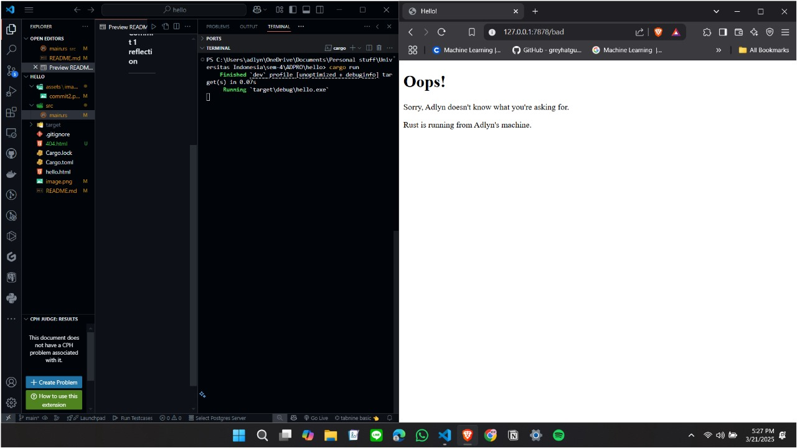

# Advance Programming - Module 6

**Andi Muhammad Adlyn Fakhreyza Khairi Putra  
2306241713**

---

### Commit 1 reflection
---
What is inside `handle_connection` method?

Metode `handle_connection` berfungsi untuk menangani koneksi yang diterima oleh server TCP. Berikut adalah penjelasan lebih detail tentang kode pada programnya:

1. **Buffering Stream:**
   ```rust
   let buf_reader = BufReader::new(&mut stream);
   ```
   Baris ini membuat objek `BufReader` yang membungkus `stream`. Tujuan dari `BufReader` adalah untuk melakukan pembacaan stream secara efisien dengan buffering, sehingga pembacaan data dapat dilakukan baris per baris.

2. **Membaca Request HTTP:**
   ```rust
   let http_request: Vec<_> = buf_reader
       .lines()
       .map(|result| result.unwrap())
       .take_while(|line| !line.is_empty())
       .collect();
   ```
   - `.lines()`: Membaca stream per baris hingga mencapai akhir input.
   - `.map(|result| result.unwrap())`: Mengambil nilai `Result<String>` dan memaksa unwrapping. Artinya, jika ada error, program akan panik (`panic!`).
   - `.take_while(|line| !line.is_empty())`: Mengambil baris-baris hingga menemukan baris kosong (`\r\n`), yang menunjukkan akhir dari header HTTP.
   - `.collect()`: Mengumpulkan baris-baris tersebut menjadi `Vec<String>` yang merepresentasikan header HTTP.

Program ini pada intinya adalah membuat server yang mendengarkan koneksi pada address `127.0.0.1:7878`. Setiap kali ada koneksi masuk (`listener.incoming()`), koneksi tersebut diteruskan ke fungsi `handle_connection`. Fungsi `handle_connection` kemudian membaca dan memproses data dari stream tersebut, lalu menampilkannya.

---

### Commit 2 reflection

---


Updates on `handle_connection` method:

Sebelumnya, fungsi `handle_connection` hanya membaca dan menampilkan request HTTP yang masuk. Sekarang, fungsinya telah diubah untuk memberikan response atas request HTTP dengan mengirimkan file HTML`hello.html`. Berikut penjelasan tambahan terkati perubahan pada method `handle_connection`.


*  **Membaca File HTML:**
   ```rust
   let contents = fs::read_to_string("hello.html").unwrap();
   ```
   - Program membaca file **hello.html** dan menyimpannya dalam variabel `contents`.
   - Jika file tidak ditemukan, program akan error (`unwrap()`).

* **Menyusun HTTP Response:**
   ```rust
   let status_line = "HTTP/1.1 200 OK";
   let length = contents.len();
   let response = format!("{status_line}\r\nContent-Length:{length}\r\n\r\n{contents}");
   ```
   - **Status Line:** Menandakan respons berhasil (`200 OK`).
   - **Content-Length:** Panjang konten HTML.
   - **Response:** Gabungan status line, header, dan isi HTML.

*  **Mengirimkan Response ke Client:**
   ```rust
   stream.write_all(response.as_bytes()).unwrap();
   ```
   - Mengirim response sebagai byte ke stream.
   - Error akan terjadi jika pengiriman gagal.

---

### Commit 3 reflection

---




Pada commit ini, terdapat perubahan yang saya lakukan, yaitu penambahan `404.html` dan penyesuaian logika pemrosesan HTTP request untuk menangani kasus URL yang tidak sesuai (404 Not Found).

* Penambahan File `404.html`:  
   File `404.html` ditambahkan sebagai halaman respons untuk request yang tidak valid atau tidak dikenali. Halaman ini memberikan informasi kepada pengguna ketika URL yang diminta tidak ditemukan di server.

* Validasi dan Respons Selektif:  
   Perubahan utama terjadi di metode `handle_connection` dan `build_response`. Berikut detailnya:

   a. Perubahan pada `handle_connection`:
   ```rust
   let request_line = http_request.get(0).unwrap();
   ```
   Sebelumnya, fungsi ini tidak memvalidasi request line yang diterima. Request line pertama diambil untuk dijadikan parameter fungsi build_response

   b. Penambahan fungsi baru `build_response`:
   ```rust
   let (status_line, filename) = if request_line == "GET / HTTP/1.1" {
      ("HTTP/1.1 200 OK", "hello.html")
   } else {
      ("HTTP/1.1 404 NOT FOUND", "404.html")
   };
   ```
   Perubahan ini menambahkan validasi sederhana untuk memeriksa apakah request line sesuai dengan format `GET / HTTP/1.1`. Jika sesuai, server merespons dengan file `hello.html` dan status `200 OK`. Jika tidak sesuai, server merespons dengan file `404.html` dan status `404 NOT FOUND`.

   Penulisan respons ke stream tetap menggunakan 
   ```rust
   stream.write_all(response.as_bytes()).unwrap();
   ```
   tetapi kini respons lebih dinamis sesuai request.

---

Commit 4 reflection

---

Pada commit ini dilakukan simulasi delay 10 detik untuk mensimulasikan masalah yang dihadapi server kita karena running pada single-thread. Penambahan delay ini dilakukan pada endpoint `/sleep`, di mana ketika request diterima, program secara eksplisit menjalankan `thread::sleep(Duration::from_secs(10));`. Hal ini menyebabkan seluruh request lain yang datang ke server selama 10 detik tersebut harus menunggu hingga proses sleep selesai.

Ketika saya mengakses `127.0.0.1:7878/sleep` di satu tab browser dan `127.0.0.1:7878` di tab lain secara bersamaan, saya mendapati kedua request tersebut mengalami delay. Untuk memastikan ini bukan masalah performa pada perangkat saya, saya mencoba mengakses hanya `127.0.0.1:7878`, dan halaman HTML berhasil ditampilkan dengan cepat. Ini menunjukkan bahwa server kita menangani request secara sequential dalam single thread. Ketika ada request lambat seperti `/sleep`, server menjadi ter-block dan tidak dapat memproses request lain hingga delay selesai. 

Kondisi ini menggambarkan keterbatasan server single-thread: jika ada satu request yang membutuhkan waktu lama, seluruh request lain ikut terdampak. Dalam skenario nyata dengan banyak pengguna, hal ini bisa berdampak buruk pada performa server secara keseluruhan. Solusi yang mungkin untuk mengatasi masalah ini adalah dengan menggunakan multithreading atau asynchronous programming agar server dapat menangani request secara concurrent. Dengan begitu, request lambat tidak akan memblokir request lainnya, dan performa server dapat tetap optimal.