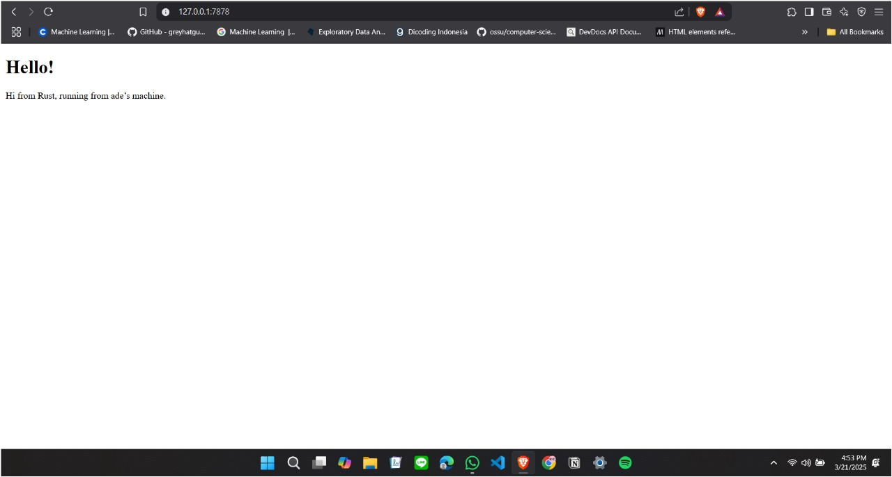

# Advance Programming - Module 6

**Andi Muhammad Adlyn Fakhreyza Khairi Putra  
2306241713**

---

### Commit 1 reflection
---
What is inside `handle_connection` method?

Metode `handle_connection` berfungsi untuk menangani koneksi yang diterima oleh server TCP. Berikut adalah penjelasan lebih detail tentang kode pada programnya:

1. **Buffering Stream:**
   ```rust
   let buf_reader = BufReader::new(&mut stream);
   ```
   Baris ini membuat objek `BufReader` yang membungkus `stream`. Tujuan dari `BufReader` adalah untuk melakukan pembacaan stream secara efisien dengan buffering, sehingga pembacaan data dapat dilakukan baris per baris.

2. **Membaca Request HTTP:**
   ```rust
   let http_request: Vec<_> = buf_reader
       .lines()
       .map(|result| result.unwrap())
       .take_while(|line| !line.is_empty())
       .collect();
   ```
   - `.lines()`: Membaca stream per baris hingga mencapai akhir input.
   - `.map(|result| result.unwrap())`: Mengambil nilai `Result<String>` dan memaksa unwrapping. Artinya, jika ada error, program akan panik (`panic!`).
   - `.take_while(|line| !line.is_empty())`: Mengambil baris-baris hingga menemukan baris kosong (`\r\n`), yang menunjukkan akhir dari header HTTP.
   - `.collect()`: Mengumpulkan baris-baris tersebut menjadi `Vec<String>` yang merepresentasikan header HTTP.

Program ini pada intinya adalah membuat server yang mendengarkan koneksi pada address `127.0.0.1:7878`. Setiap kali ada koneksi masuk (`listener.incoming()`), koneksi tersebut diteruskan ke fungsi `handle_connection`. Fungsi `handle_connection` kemudian membaca dan memproses data dari stream tersebut, lalu menampilkannya.

---

### Commit 2 reflection

---



Updates on `handle_connection` method:

Sebelumnya, fungsi `handle_connection` hanya membaca dan menampilkan request HTTP yang masuk. Sekarang, fungsinya telah diubah untuk memberikan response atas request HTTP dengan mengirimkan file HTML`hello.html`. Berikut penjelasan tambahan terkati perubahan pada method `handle_connection`.


*  **Membaca File HTML:**
   ```rust
   let contents = fs::read_to_string("hello.html").unwrap();
   ```
   - Program membaca file **hello.html** dan menyimpannya dalam variabel `contents`.
   - Jika file tidak ditemukan, program akan error (`unwrap()`).

* **Menyusun HTTP Response:**
   ```rust
   let status_line = "HTTP/1.1 200 OK";
   let length = contents.len();
   let response = format!("{status_line}\r\nContent-Length:{length}\r\n\r\n{contents}");
   ```
   - **Status Line:** Menandakan respons berhasil (`200 OK`).
   - **Content-Length:** Panjang konten HTML.
   - **Response:** Gabungan status line, header, dan isi HTML.

*  **Mengirimkan Response ke Client:**
   ```rust
   stream.write_all(response.as_bytes()).unwrap();
   ```
   - Mengirim response sebagai byte ke stream.
   - Error akan terjadi jika pengiriman gagal.

---